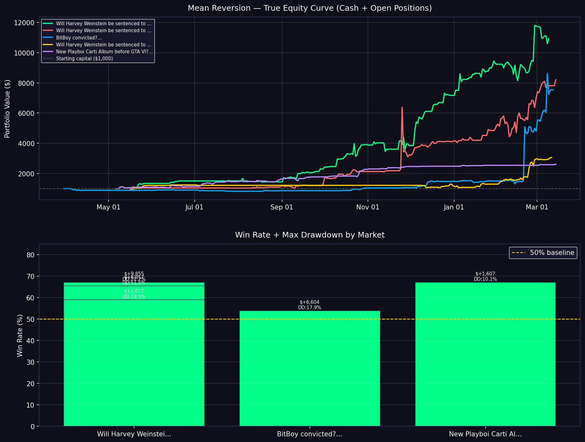

# Reversion — Polymarket Signal & Risk System

> Detects prediction market overreactions and generates risk-adjusted trade recommendations using backtesting, live orderbook depth, and AI news validation.

A 7-layer quantitative signal generation and portfolio management system for Polymarket prediction markets. Built for the Orderflow 001 Hackathon — 48-hour build sprint.

```bash
python main.py
```

> **Note:** This is a signal generation and risk management system. Trade recommendations are output as actionable signals with Kelly-sized allocations. Execution can be connected via the Synthesis API or Polymarket CLOB API.

---

## Key Results

- **Best market PnL: +$9,066** from $1,000 starting capital (Weinstein 10-20yr, 207 trades)
- **Average mean reversion PnL: +$822** across all 30 backtested markets
- **Win rates: 47–61%** depending on market
- **Sharpe up to 0.56** (Edmonton Oilers, 33 trades)
- **Mean reversion beats momentum** — avg PnL +$822 vs -$253
- **207 trades** on best market, **1,700+ total trades** across all markets
- **Two-sided signals:** BUY YES + SHORT YES

---

## Why This Works

Prediction markets are often inefficient due to:
- Retail-driven sentiment and overreaction to news
- Low liquidity in niche markets causing exaggerated price swings
- Delayed information incorporation — crowds update slowly
- No active market makers correcting mispricings in real time

This creates short-term mispricing which the system exploits via mean reversion — when a price drops sharply, it tends to overcorrect, then bounce back. The system catches that bounce.

Traditional quant strategies work on this same principle in stock markets, but prediction markets are even less efficient, meaning the edge is larger and more persistent.

---

## System Pipeline

```
Market Data (50 markets)
        ↓
1. Signal Detection      adaptive threshold per market volatility
        ↓
2. Data Split            training / gap / signal (no data leakage)
        ↓
3. Walk-Forward Backtest mark-to-market equity curve + max drawdown
        ↓
4. Kelly Criterion       mathematically optimal position sizing
        ↓
5. Orderbook Depth       live bid/ask imbalance confirmation
        ↓
6. AI + News Filter      LLaMA 3.1 reads real headlines (optional)
        ↓
7. Portfolio Allocation  confidence-ranked, capital-constrained
        ↓
Trade Recommendations Report
```

---

## Strategy Logic

**Mean Reversion** — when a market's implied probability moves sharply over 3 days, it tends to overcorrect. The system identifies the reversal opportunity.

- **BUY YES** — price dropped sharply → buy YES shares, expect probability to bounce back up
- **SHORT YES** — price rose sharply → buy NO shares, expect probability to fall back down
  *(SHORT YES = effectively buying NO shares, betting the probability will decrease)*

**Adaptive threshold** — instead of a fixed signal threshold, each market gets its own threshold based on its historical volatility (std dev × 1.5). A volatile market needs a bigger move to trigger a signal.

**Three filters before any signal fires:**
1. Volume confirmation — 24h volume must be above this market's own daily average
2. Time decay filter — skip markets resolving in less than 3 days (prices lock in near resolution)
3. Adaptive threshold — move must exceed this market's own volatility baseline

---

## Performance Metrics

Backtested across 30 active Polymarket markets using full price history.

| Market | Trades | Buy | Short | Win Rate | PnL | Sharpe |
|---|---|---|---|---|---|---|
| Weinstein 10-20yr | 207 | 101 | 106 | 54.1% | +$9,066 | 0.19 |
| Weinstein 20-30yr | 205 | 101 | 104 | 55.6% | +$5,502 | 0.22 |
| BitBoy Convicted | 197 | 99 | 98 | 52.3% | +$4,055 | 0.14 |
| Weinstein 30yr+ | 73 | 31 | 42 | 60.3% | +$1,399 | 0.15 |
| Weinstein no prison | 115 | 51 | 64 | 61.7% | +$1,006 | 0.17 |
| Ukraine World Cup | 115 | 59 | 56 | 47.8% | +$520 | 0.27 |
| Sweden World Cup | 130 | 62 | 68 | 45.4% | +$486 | 0.22 |
| Trump out as President | 49 | 22 | 27 | 61.2% | +$375 | 0.29 |
| Edmonton Oilers | 33 | 20 | 13 | 54.5% | +$228 | 0.56 |
| New Rihanna Album | 134 | 61 | 73 | 52.2% | +$225 | 0.14 |

**Strategy comparison:**
- Mean Reversion average PnL: **+$822**
- Momentum average PnL: **-$253**
- Winner: **Mean Reversion** — across all 30 markets

**Backtest methodology:**
- Clean train/gap/signal split — prevents data leakage
- Walk-forward simulation — capital locked into positions during hold period
- Mark-to-market equity curve — tracks true portfolio value including open positions
- 3-day hold period (realistic exit timing, not t+1)
- Max 3 concurrent positions at once



---

## Live System Output

```
======================================================================
  ORDERFLOW 001 — POLYMARKET QUANT SYSTEM
  2026-03-24 06:08:55
  Signal → Confidence Score → Portfolio Allocation
======================================================================

[1/5] Fetching markets...         50 markets loaded
[2/5] Signal detection...         2 signals (2 BUY, 0 SHORT)
[3/5] AI validation (optional)... AI ok: 1 | failed (graceful): 1
[4/5] Confidence scoring + ranking...

      Market                           Dir        Conf  WinP  Kelly   OB  AI
      BitBoy convicted?                BUY_YES    21.7   53%  25.0%    N  N/A

[5/5] Portfolio allocation ($10,000 capital)...

  Market     : BitBoy convicted?
  Action     : BUY YES — price dropped, expect bounce
  Confidence : 21.7/100
  Allocation : $1,750.00 (17.5% of portfolio)
  Price      : 11.6%  (-18.0% / 3d | threshold: 8.0%)
  Backtest   : 106 trades | 52.8% win | $+6,418 PnL | MaxDD: 17.9%
  Kelly Bet  : 25.0% → $1,750 on $10,000

  Capital deployed  : $1,750.00 (17.5%)
  Cash reserve      : $8,250.00 (82.5%)
```

---

## Architecture

```
utils.py          single source of truth for all shared logic
fetch_markets.py  live market scanner with edge scoring
backtest.py       walk-forward backtesting engine
chart.py          PnL curve + win rate visualization
monitor.py        live signal monitor, scans every 5 minutes
orderbook.py      orderbook depth + Kelly position sizing
ai_signal.py      AI + news signal analyzer
main.py           full pipeline entry point
```

### Data Sources

| Source | Usage |
|---|---|
| Polymarket Gamma API | market metadata, prices, volume |
| Polymarket CLOB API | full price history, live orderbook |
| Google News RSS | real-time headlines per market |
| Groq / LLaMA 3.1 | AI signal validation (optional) |

---

## Quant Details

### Adaptive Threshold
```python
threshold = std_dev(daily_price_changes) * 1.5
threshold = clamp(threshold, 0.01, 0.08)
```

### Kelly Criterion
```python
f = (win_prob * b - (1 - win_prob)) / b
f = clamp(f, 0, 0.25)   # half-Kelly safety cap
```
where `b = avg_win / avg_loss`

### Confidence Score (0-100)
Built from independent factors only — no double counting:
- Win probability from historical trades (0-40 pts)
- Signal magnitude vs adaptive threshold (0-15 pts)
- Orderbook confirmation — independent data source (0-25 pts)
- Max drawdown penalty
- Days to resolution (0-10 pts)
- Volume / fillability proxy (0-10 pts)
- AI modifier, optional (±10 pts)

### Portfolio Allocation Rules
- Signals ranked by confidence score
- Capital per trade = Kelly fraction × total capital
- Single position cap: 30% of total capital
- Total deployment cap: 80% of total capital
- Event group limit: max 2 positions per event

### Data Leakage Prevention
```
Full history layout:
[.... TRAINING (n-7 points) ....] [GAP (3)] [SIGNAL (4)]

Training → volatility computation, backtest, Kelly
Signal   → detect current price move only
Gap      → 3-point buffer prevents boundary leakage
```

---

## Setup

**1. Clone the repo**
```bash
git clone https://github.com/YOUR_USERNAME/orderflow-001
cd orderflow-001
```

**2. Install dependencies**
```bash
pip install requests groq python-dotenv matplotlib
```

**3. Create `.env` file**
```
GROQ_API_KEY=your_groq_key_here
```
Get a free key at console.groq.com — no credit card needed.

**4. Run**
```bash
python main.py
```

---

## Individual Modules

```bash
python fetch_markets.py   # scan live markets, see edge scores
python backtest.py        # run full backtest across 30 markets
python orderbook.py       # live orderbook + Kelly analysis
python ai_signal.py       # AI + news analysis on current signals
python chart.py           # generate PnL visualization
python monitor.py         # live signal monitor (runs every 5 min)
```

---

## What's Next — Execution Layer

This system is the **signal and risk layer** of a complete trading pipeline. To connect execution:

- **Synthesis API** (`synthesis.trade`) — unified API for Polymarket + Kalshi order placement
- **Polymarket CLOB API** — direct order placement with wallet authentication

The output of `main.py` already provides everything needed: market ID, direction, position size, and confidence score. Plugging in Synthesis would turn recommendations into live orders in under 100 additional lines of code.

---

## Tracks

**Quantitative Trading** — signal generation, mean reversion strategy, backtesting engine, risk-adjusted recommendations

**AI-Augmented Systems** — LLM reads real news headlines and validates signals before output

**Automation & Infrastructure** — backtesting framework, portfolio allocator, live signal monitor

---

## Built With

- Python (no external trading libraries)
- Polymarket CLOB + Gamma APIs
- Groq / LLaMA 3.1
- Matplotlib

---

## Hackathon

**Orderflow 001** — 48-hour build sprint
March 22–24, 2026